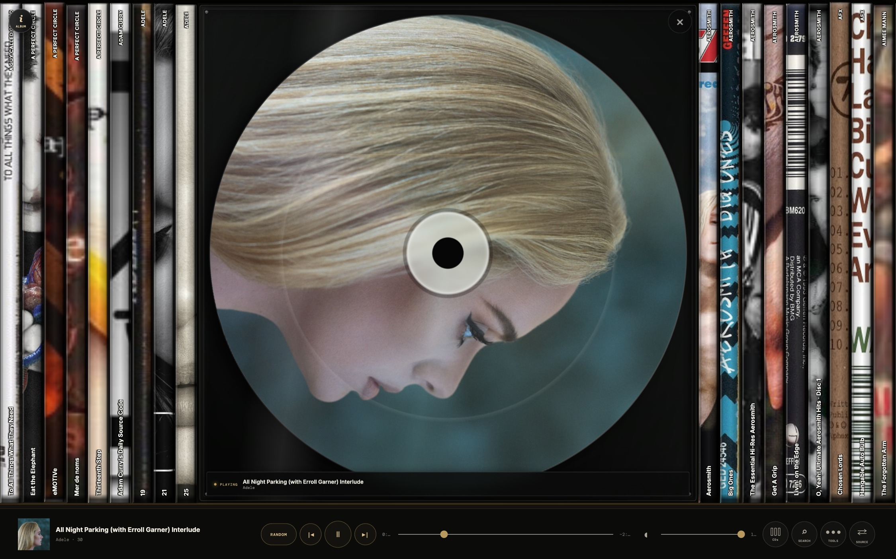
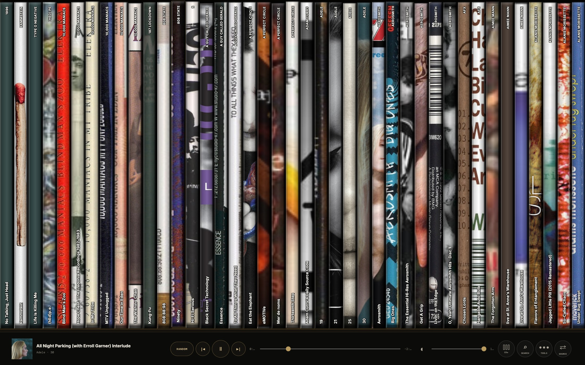
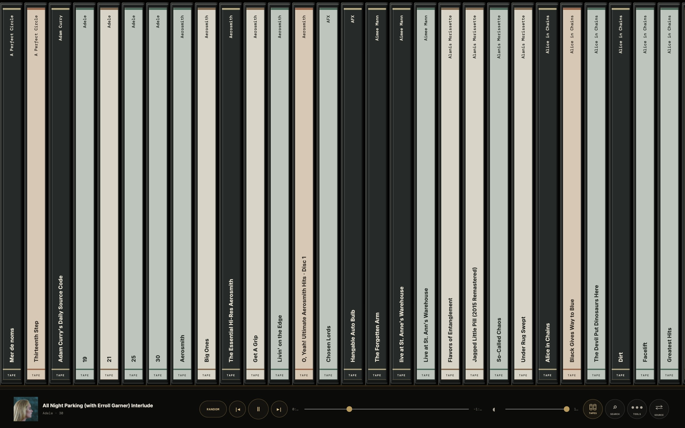
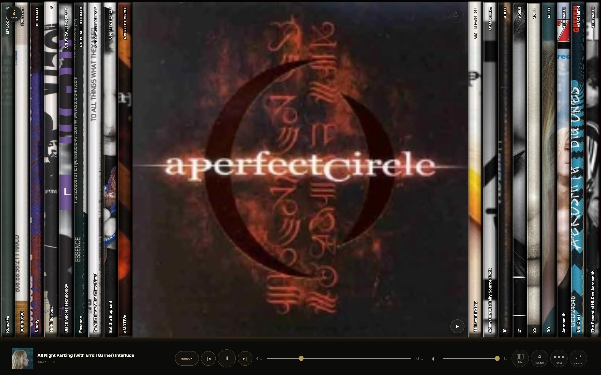
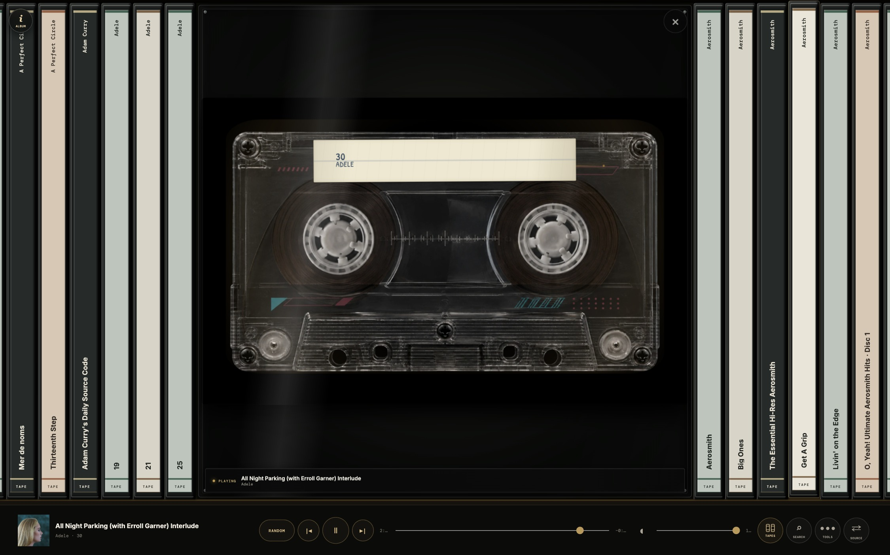
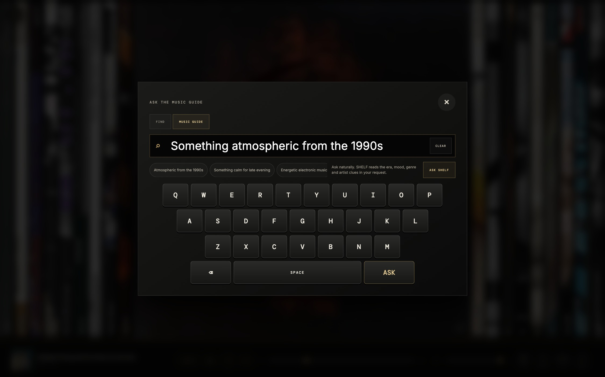
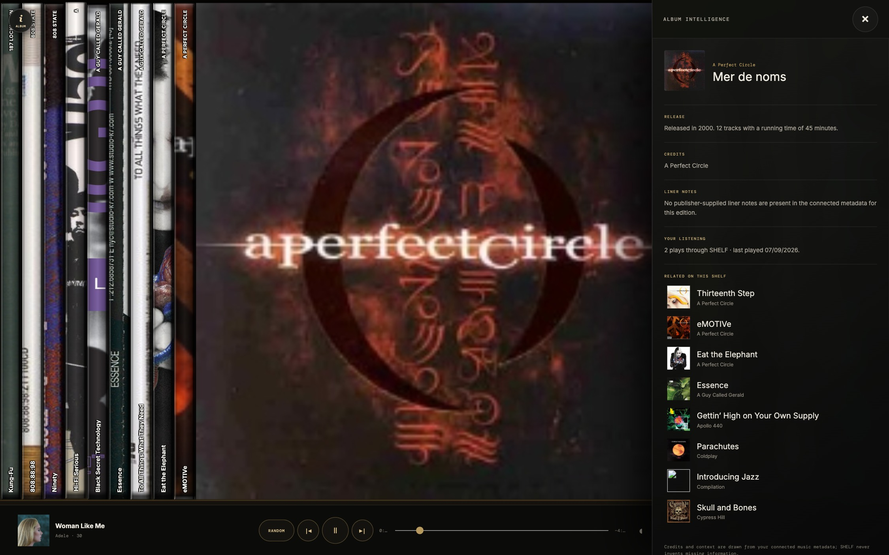
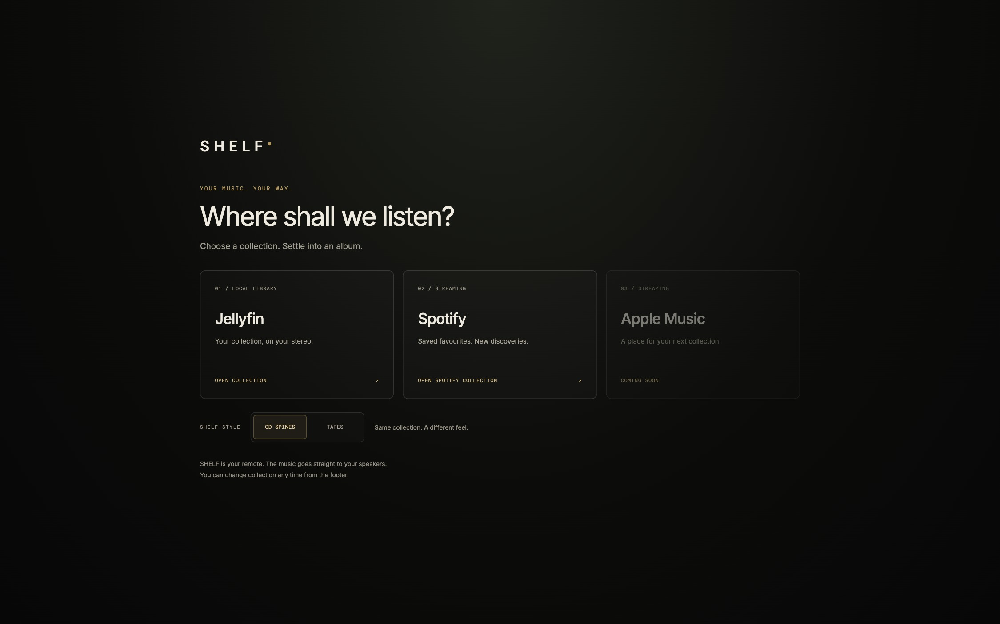

# SHELF

**A touch-first, self-hosted album browser and music remote for Jellyfin, Plex, Spotify, NAS folders and UPnP/DLNA streamers.**

SHELF turns a personal music collection into a tactile, full-screen shelf of readable CD or cassette spines, with an efficient paged cover browser for older tablets. It runs on an always-on home server and sends music directly to a chosen network player rather than routing audio through the browser.

Choose Jellyfin, Plex, Spotify Premium or a mounted music folder when SHELF opens. The footer's **Source** button returns to the chooser without stopping music. Apple Music is visibly reserved as **Coming soon**, not presented as an implemented integration.

SHELF is an independent open-source project. It is not affiliated with or endorsed by any music-service, hardware or artwork provider. See [THIRD_PARTY_NOTICES.md](THIRD_PARTY_NOTICES.md) for service, artwork, font and trademark information.

## Connections at a glance

| Music source | What SHELF browses | How it reaches the stereo |
| --- | --- | --- |
| Jellyfin | Albums, tracks and available packaging artwork | Direct media URL sent to the selected UPnP/DLNA player |
| Plex | A Plex music library and its cover artwork | Authenticated Plex media URL sent to the selected player |
| Music files | Tagged audio in one mounted local or NAS music folder | SHELF's range-enabled LAN stream sent to the selected player |
| Spotify Premium | Saved albums and explicit catalogue searches | Spotify Connect on the chosen Spotify device |

Compatible local outputs are discovered from their real UPnP device descriptions. This includes many renderers and receivers from WiiM, Naim, Cambridge Audio, Denon/Marantz, Yamaha/MusicCast, Linn, Sony, Pioneer/Onkyo and other standards-compatible manufacturers. Support depends on the services exposed by each model and firmware.

## Highlights

- Three remembered touch-first views: readable CD spines, cassette spines and a lightweight paged cover browser.
- Full-height album covers, an animated transparent CD player and a photographic cassette transport.
- Persistent album playback with next, previous, play/pause, seek, volume and random controls.
- Natural-language Music Guide, touch keyboard search, Album Intelligence and small personal crates.
- Real front artwork from the connected library, plus genuine archived backs and cassette packaging when available.
- A local control API for Home Assistant, Apple Shortcuts and trusted LAN agents.
- Four restrained colour atmospheres that leave the shelf itself unchanged.

## The interface



| CD collection | Tape collection |
| --- | --- |
|  |  |

| Album artwork | Cassette playback |
| --- | --- |
|  |  |

| Music Guide | Album Intelligence |
| --- | --- |
|  |  |



Choose **CD spines**, **Tapes** or **Covers** on the launch screen, or cycle through them with the view button in the footer. Tape mode uses genuine cassette packaging from MusicBrainz/Cover Art Archive when it can match the edition, and a restrained readable text insert when it cannot. Covers renders ten resized thumbnails at a time, supports touch swiping and page buttons, and uses a static full-height now-playing cover to minimise animation and image-decoding work. A first visit from an older iPad defaults to Covers; any saved choice is always respected. Devices that request reduced motion keep the CD and cassette mechanisms still rather than running a continuous animation. Your display choice is saved per browser/device and applies across compatible sources. Changing the view never changes playback. Genuine back-cover controls appear only when that artwork exists; Spotify artwork stays unmodified in CD mode.

## How it works

```text
Browser (React/Vite) → SHELF server (Fastify/TypeScript)
                           ├─ Jellyfin or Plex REST/images
                           ├─ Mounted local/NAS music folders
                           └─ Discovered UPnP AVTransport/RenderingControl

Music URL ─────────────────────────────→ Selected network player → amplifier
```

The server keeps credentials and LAN protocols out of the browser. Local-library views poll the selected player every two seconds (four seconds in the older-iPad Covers view), but position-only updates are isolated from the collection so they do not redraw the shelf. Spotify uses its Web API to control a user-selected Spotify Connect device; it never sends Spotify audio through the local-library/UPnP path. Playback polling is shared/cached across clients, slows down on errors, and skips hidden tabs.

## Requirements

- Node.js 20+
- At least the existing Jellyfin connection, plus any optional Plex or mounted-folder sources
- A supported UPnP/DLNA renderer on the same trusted network as the SHELF server
- A Jellyfin user ID and dedicated API token
- Static/reserved LAN addresses (or stable local DNS names) for media servers and players are recommended

## Configure and run locally

```sh
cp .env.example .env
# Edit .env with LAN-reachable addresses and credentials.
npm install
npm run dev
```

Open `http://localhost:5173`. The server runs on port 8787. Verify it with `curl http://localhost:8787/api/health`.

Important: `JELLYFIN_URL` must not be `localhost` unless Jellyfin and the WiiM are the same machine. WiiM receives this URL and must be able to fetch it. Use the server's LAN address, such as `http://192.168.1.10:8096`.

## Network players

Open **Output** in the footer to scan the LAN and choose a player. SHELF reads each device's advertised UPnP description, so it uses the device's actual control addresses rather than assuming WiiM-specific paths. This standards-based route is intended for compatible streamers and receivers from WiiM, Naim, Cambridge Audio, Denon/Marantz, Yamaha/MusicCast, Linn, Sony, Pioneer/Onkyo and others. Exact support still depends on the model and firmware exposing a controllable `AVTransport` and `RenderingControl` service.

If multicast discovery cannot cross a VLAN, enter the player's IP address or complete UPnP description URL manually. The selected player is stored privately in `.data/output.json`. Changing it never starts music. `WIIM_HOST` remains as a backward-compatible optional fallback for existing installations.

The UPnP `SetNextAVTransportURI` action is optional. SHELF uses it for gapless device-side album queues when available and falls back to server-managed track changes on compatible players that omit it.

## First real playback test

1. Confirm albums and artwork load in SHELF.
2. Open an album and press a track (or **Play Album**, which starts track 1).
3. SHELF gives the selected player a direct audio URL using UPnP `SetAVTransportURI`, then calls `Play`.
4. Confirm the persistent strip shows the player's real state and that play/pause, seek, mute, and volume work.

If playback fails, check the server log. Confirm the selected player's description URL is reachable from SHELF and that the configured media-server URL is reachable by the player.

## Security and network constraints

UPnP renderers cannot attach Jellyfin authorization headers. For the vertical slice, the direct media URL sent only by the backend to WiiM contains the Jellyfin token as a query parameter. Use a dedicated, least-privilege Jellyfin user/token, keep SHELF on a trusted LAN, do not expose the backend or UPnP ports to the internet, and use HTTPS or a private network before remote access. A later hardening option is a short-lived signed stream gateway, but that would relay bytes through SHELF and is deliberately not part of this proof.

## Commands

- `npm run dev` — frontend and backend development servers
- `npm run build` — production builds
- `npm test` — backend integration/auth tests and React UI interaction tests
- `npm run typecheck` — strict TypeScript checks

## Always-on Proxmox deployment

SHELF can run as a single production service in a small Debian LXC. The production server serves both the compiled interface and `/api` on port 8787, so the MacBook does not need to remain on. See [`deploy/README.md`](deploy/README.md) for the LXC sizing, installation, systemd service, update, and firewall instructions.

## Plex and NAS/music folders

For Plex, set `PLEX_URL` and `PLEX_TOKEN`; `PLEX_MUSIC_LIBRARY_ID` is optional when the server has one music library. SHELF uses Plex's JSON API, proxies cover artwork so tokens never reach the browser, and sends the selected player the authenticated media-part URL. Keep the Plex server reachable from the player.

For a plain NAS or disk, mount the specific music folder—not the root of a large shared drive—into the SHELF host/container and set `FILES_MUSIC_PATH` to that mount. Also set `SHELF_PUBLIC_URL` to SHELF's LAN-reachable address, for example `http://192.168.1.30:8787`. Prefer a read-only mount: SHELF only needs to inspect metadata, read artwork and stream audio.

SHELF reads embedded tags from AAC, AIFF, FLAC, M4A/ALAC, MP3, Ogg/Opus, WAV and WMA files, groups them into albums, and uses embedded artwork or a case-insensitive `cover`, `folder` or `front` JPEG/PNG in the album directory. A conventional `Artist/Album/Track` folder layout provides useful fallback names when tags are incomplete. LAN-file albums do not claim to have a back cover when none exists.

The first opening builds an index from the mounted folder and may take several minutes for a very large collection. SHELF saves that index privately in `.data/file-library-v1.json`, loads it immediately after future service restarts, and refreshes stale metadata quietly in the background while continuing to show the saved catalogue. Use `POST /api/files/refresh` when an immediate rescan is required. Keep `.data` out of source control because it contains private integration state and local file paths.

## Current scope

Implemented: complete Jellyfin, Plex and mounted-folder collections, cover artwork, virtualized touch-first horizontal spine browsing, album details/tracks, continuous album playback, play/pause/stop/seek/volume/mute backend operations, and selected-player state polling. Missing Jellyfin covers are resolved conservatively through MusicBrainz identifiers and the Cover Art Archive; weak metadata matches are rejected rather than showing an incorrect cover. Physical `Spine` or `Back + Spine` scans are cropped into cached 110×1000 spine assets. Opening an album presents its high-resolution front and archived back artwork as an open jewel case.

Local-library album playback is owned by the server. Starting a track loads its album queue in source order and, where supported, preloads the next track with `SetNextAVTransportURI`. The server observes the renderer's track URI and replenishes its next-track buffer; the player performs the actual transition even if the browser closes or the iPad sleeps. Next/Previous use this shared queue, not the browsed album or stale browser state. The album stops at its end; explicit stops stay stopped. A different source taking over relinquishes the local queue. Queue updates retry transient connection failures and report a warning. The in-memory album queue is not restored after a service restart, so start an album again after updating/restarting SHELF.

Also implemented: a five-source launch chooser (including the honest Apple Music placeholder), three saved collection views including the low-overhead Covers mode, touch-keyboard search and clear-filter, a natural-language music guide, an optional metadata/listening-history drawer, small persistent personal crates, four subtle room atmospheres, footer transport and random-track controls, centered album expansion, remembered network-player selection, and a persistent mounted-folder catalogue.

## Local control API

Trusted devices on the home LAN can use the versioned JSON API at `/api/control/v1`:

- `GET /status?source=jellyfin` — current playback state.
- `GET /albums?source=jellyfin&q=radiohead&limit=25` — find albums.
- `POST /play` with `{ "source": "jellyfin", "albumId": "…", "trackId": "…" }` — start an album or optional track.
- `POST /transport` with `{ "source": "jellyfin", "action": "pause" }` — play, pause, stop, next or previous.
- `POST /volume` with `{ "source": "jellyfin", "volume": 35 }` — set volume.

The machine-readable description is at `/api/control/v1/openapi.json`. These endpoints deliberately have no cloud dependency or account system: keep the service on a trusted LAN and do not forward port 8787 to the internet.

## Spotify Premium (optional)

Configure `SPOTIFY_CLIENT_ID` and `SPOTIFY_REDIRECT_URI` in `.env`, restart the server, then choose Spotify at launch. Registration, the one-time Proxmox SSH-tunnel login, and private credential storage are described in [deploy/README.md](deploy/README.md#optional-spotify-premium-connection). The same local loopback callback works during development: after building, open `http://127.0.0.1:8787/` to start and finish sign-in. No Client Secret is used.

Spotify supports:

- Your saved albums (20 per displayed content set), with pagination and local filtering.
- Explicit catalogue searches (10 results per API page), not a request on every keystroke.
- Full album-context playback; Spotify handles continuous playback and next/previous.
- Play/pause, seek, shuffle, and device-supported volume/mute controls.
- An explicit speaker picker; selecting a speaker or source does not itself start music.
- PKCE with expiring, browser-bound state; refresh tokens kept server-side, outside static assets, in `.data/spotify.json` with mode 0600. One household account is shared by trusted-LAN clients.

Spotify-provided images remain unmodified and attributed with the official logo and Spotify links. The Spotify view uses text-only spines and complete covers, with controls in the footer; it does not crop covers into spines, overlay play buttons, or request invented back-cover scans. Jellyfin's physical artwork and flip controls remain separate and unchanged.

Before real-account sign-in, only mocked Spotify integration tests can run. A Spotify developer app, Premium subscription and allowed user are required for a live test. Current Spotify development quotas and API restrictions apply. Apple Music support, playlist browsing and multiple independent Spotify accounts are not implemented.

References: [Spotify Web API](https://developer.spotify.com/documentation/web-api), [PKCE](https://developer.spotify.com/documentation/web-api/tutorials/code-pkce-flow), [redirect requirements](https://developer.spotify.com/documentation/web-api/concepts/redirect_uri), [design guidelines](https://developer.spotify.com/documentation/design).

## API research basis

- Jellyfin's generated API defines user-scoped `Items` queries and original/download media endpoints: https://github.com/jellyfin/jellyfin-sdk-typescript
- Jellyfin documents HTTP streaming and local-network addressing: https://jellyfin.org/docs/general/post-install/networking/
- UPnP defines standard MediaRenderer, AVTransport and RenderingControl services: https://upnp.org/specs/av/UPnP-av-MediaRenderer-v1-Device.pdf
- Naim documents control from third-party UPnP control points: https://www.naimaudio.com/help/upnp-and-local-playback-operation-compatibility-and-control
- Cambridge Audio describes its network streamers as UPnP renderers: https://www.cambridgeaudio.com/eur/en/faqs/upnp-guide-and-troubleshooting
- Denon documents compatible units acting as DLNA Digital Media Renderers: https://manuals.denon.com/rcdn9/eu/en/OKNRSYhidqmtab.php
- Yamaha documents enabling control from a DLNA Digital Media Controller: https://manual.yamaha.com/av/18/rxv685/en-US/319085835.html
- Plex documents its JSON media-server API and authentication headers: https://developer.plex.tv/pms/
- MusicBrainz's Cover Art Archive provides curated release artwork and 250/500/1200px variants: https://musicbrainz.org/doc/Cover_Art_Archive/API

Every discovered player's advertised device description remains the source of truth for its control URLs and service versions.

## License

SHELF is licensed under the [GNU Affero General Public License v3.0](LICENSE) (`AGPL-3.0-only`). If you modify SHELF and make the modified version available over a network, the licence requires you to offer its corresponding source code to those users.
